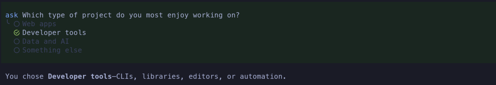
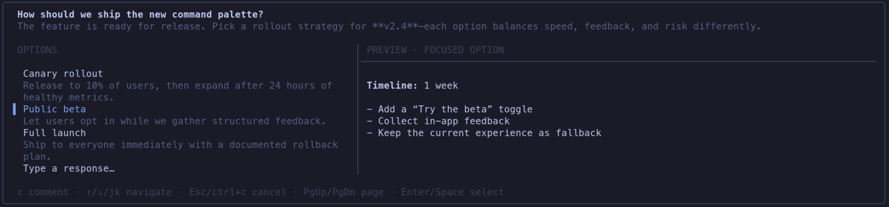
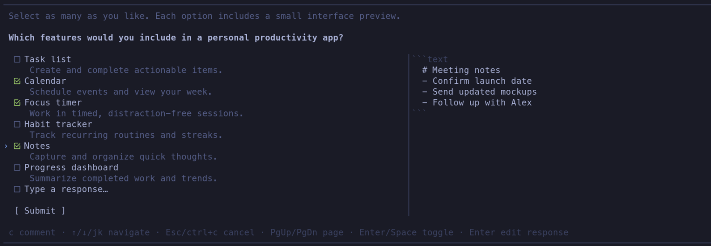
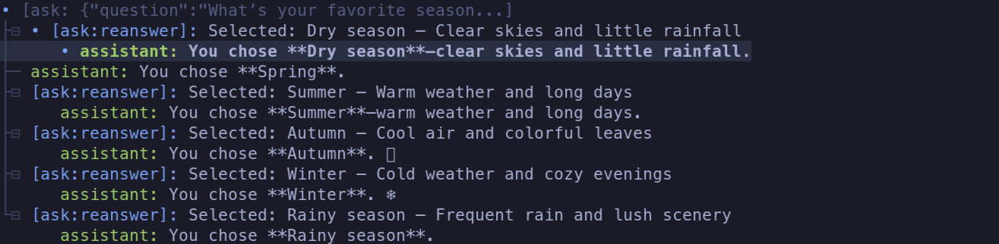

# @pi9/ask

Ask adds interactive questions to [Pi](https://github.com/earendil-works/pi-mono), turning moments when Pi needs your input into clear, keyboard-driven choices with descriptions, previews, comments, and freeform responses.

## Feature overview

- **Answer revisions** — Reopen an Ask entry from `/tree` and continue with a new answer.
- **Tool-call rewriting** — Replace answered standalone Ask exchanges in model context with compact, decision-focused responses while preserving the original session history.
- **Lean tool definition** — A highly optimized description and schema minimize prompt overhead while staying compatible across providers.
- **Rich previews** — Inspect Markdown previews before choosing.
- **Multi-select** — Choose any number of options, then submit them together.
- **Comments and custom responses** — Add context to a choice or write your own response.
- **Responsive layout** — Use side-by-side previews on wide terminals and stacked, scrollable content in smaller ones.
- **Keyboard-first controls** — Navigate with Pi keybindings or familiar **j/k** shortcuts.
- **Timeouts and RPC support** — Set response deadlines and answer through either the TUI or an RPC client.

## Install

```bash
pi install npm:@pi9/ask
```

## In action

### Make a quick choice

Choose from a focused list and see your answer directly in the conversation.



### Preview the result

Options can include Markdown previews, making it easy to compare proposed output before deciding.



### Select more than one

Multi-select questions combine checkboxes, descriptions, previews, optional freeform input, and an explicit Submit action.



### Revise an earlier answer

Open an Ask entry from `/tree` to answer it again and continue the conversation from your revised choice.



## Controls

Ask temporarily replaces the editor with a question. It follows your configured Pi selection keybindings and also supports **j/k** for navigation.

| Key | Action |
| --- | --- |
| **↑/↓** or **j/k** | Move between options |
| **Enter** or **Space** | Select an option, toggle a checkbox, or activate the highlighted response or Submit row |
| **c** | Add or edit a comment on the highlighted option |
| **Escape** | Discard the current draft, or cancel from the option list |
| **Ctrl+C** | Cancel from anywhere |

Comments let you qualify a selection without writing a separate message. When a question allows a custom response, highlight **Type a response…** and press **Enter** or **Space** to open the editor.

## Advanced behavior

### Tool-call rewriting

Ask rewrites answered standalone exchanges before they are sent back to the model, replacing the Ask call and its answer record with a compact `ask_response` message. The replacement keeps the question, optional background, single- or multi-select mode, selected option labels and descriptions, comments, and any freeform response. It leaves out unselected options and all Markdown previews.

The main purpose is to keep proposed alternatives from being mistaken for decisions. Once you choose an answer, the model sees only what you selected and the context attached to that selection—not every option it originally offered. As a secondary benefit, dropping unused answers, previews, and the surrounding tool-call protocol reduces the amount of context carried into later turns.

The answer can come from either a successful native tool result or a valid revision submitted from `/tree`. A revision becomes the authoritative answer, replacing the earlier result in model context even if that result is absent or unsuccessful.

This rewrite affects only the model-facing context. The original messages remain in the stored session, so the conversation still renders normally and the question can still be reopened from `/tree`. Ask rewrites only unambiguous calls and answers that validate against each other; otherwise, it leaves the messages untouched rather than risk producing a misleading response or an unmatched tool call.

### Responsive previews

Previews appear beside the options in terminals at least 88 columns wide and stack below them in narrower layouts. They support Markdown and update as you move between options. While you edit a comment or freeform response, the preview is hidden to leave more room for writing.

### Long questions

Ask adapts to the available terminal height rather than growing beyond the screen. When content overflows, `↑`, `↓`, and `↕` indicators show that more is available above, below, or in both directions. **Page Up** and **Page Down** move through longer lists quickly.

### Revising answers from `/tree`

In TUI mode, select a standalone Ask entry in `/tree` to reopen the original question, including its descriptions and previews. Submitting a new answer updates that entry and immediately continues the conversation. Pressing **Escape** cancels the revision without changing anything.

Answers and revisions follow the active session branch, so alternate branches can retain different choices.

### Timeouts

Set `PI9_ASK_TIMEOUT_MS` to apply a default response deadline in milliseconds:

```bash
PI9_ASK_TIMEOUT_MS=30000 pi
```

Set it to `0` to disable the default timeout. A question-specific deadline takes precedence when present. The deadline covers the complete interaction, including comments and freeform editing; expiry is reported separately from cancellation.

### RPC mode

Ask also works in Pi's RPC mode through standard selection and input dialogs. Multi-select answers use comma-separated option numbers, and comments are collected in follow-up dialogs. The richer live checkbox and preview interface is available only in the TUI.

Ask requires an interactive TUI or RPC client and remains inactive when no user interface is available.
