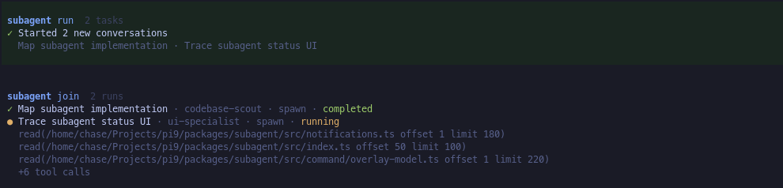

# @pi9/subagent

Delegate focused work from Pi to context-isolated child conversations. The single `subagent` tool provides agent discovery, side-effect-free inventory and inspection, asynchronous runs, live steering, blocking retrieval, explicit cleanup, recursive delegation, and live progress.


## Feature overview

- **Retained conversations** preserve child context for follow-up runs until the parent explicitly removes the conversation.
- **Asynchronous runs and exact joins** let the parent continue working after spawning or resuming work, then wait for and retrieve specific runs by ID.
- **Bounded inspection, steering, and cancellation** let the parent check progress, redirect an active run, or stop it while retaining its outcome.
- **Recursive delegation** lets subagents run, inspect, steer, cancel, and join their own descendants under tree-wide ownership and concurrency rules.
- **Live progress** shows queued and running work, recent tool activity, recursive children, and completed answers in tool and widget views.
- **Unified conversation management** provides live status, completed output, follow-up prompts, agent discovery, cleanup, and settings through `/subagents`.
- **Focused tool actions** separate agent discovery, side-effect-free inventory, task execution, blocking retrieval, and cleanup without adding multiple tools to the parent context.
- **Minimal tool prompt size** keeps delegation overhead low and reduces context bloat in the parent conversation.

## Install

```bash
pi install npm:@pi9/subagent
```

## Define agents

Agent markdown is discovered from the user `${PI_AGENT_DIR ?? ~/.pi/agent}/agents` directory and the nearest project `.pi/agents`. Project definitions override same-named user definitions by default.

For example, `.pi/agents/scout.md` defines a project-local read-only agent:

```markdown
---
name: scout
description: Read-only codebase reconnaissance
model: anthropic/claude-sonnet-4
tools: read, bash
---

Inspect the repository and return concise, evidence-backed findings.
```

| Frontmatter | Required | Meaning |
| --- | --- | --- |
| `name` | yes | Runtime agent name. |
| `description` | yes | Non-blank discovery summary. |
| `model` | no | `provider/model` or an unambiguous model id. |
| `thinking` | no | `off`, `minimal`, `low`, `medium`, `high`, `xhigh`, or `max`. |
| `tools` | no | Comma-separated allowlist; include `subagent` for recursive delegation. |
| `skills` | no | Comma-separated default skills. A spawn-task value replaces this list. |

The body becomes the child system prompt. `spawns` entries require `agent` and `prompt`; `label` is optional, and entries may override supported execution options such as model, thinking, working directory, and skills. A model requested by either the task or agent definition must resolve; an unknown or malformed value fails that task instead of falling back. When neither specifies a model, the child inherits the parent's model. An explicit task `cwd` is resolved relative to the parent's working directory and must identify an existing directory. `resumes` entries identify a conversation and create another run with the supplied prompt; the conversation's agent and execution context remain fixed. `messages` entries identify an active run and queue the supplied `message` through Pi's steering boundary without creating another run. `cancel` targets exact queued or running runs by `runId`.

## Tool actions

| Action | Behavior |
| --- | --- |
| `agents` | Discover agent definitions and their resolved defaults. |
| `list` | Return a lightweight inventory of conversations and runs without run output. It is pure: it acknowledges nothing and changes no lifecycle state. |
| `run` | Start `spawns`, `resumes`, or both and return matching receipt arrays under `data.spawns` and `data.resumes`. Both task types create asynchronous runs. |
| `steer` | Send `messages` to existing running runs and return ordered lifecycle receipts after Pi accepts each message. |
| `cancel` | Abort exact queued or running runs while retaining their conversations and aborted outcomes for `inspect` and `join`. Malformed, unknown, terminal, or unauthorized targets become ordered per-target errors. |
| `inspect` | Return bounded status, running phase, current message, recent tool activity, steer receipts, and terminal error diagnostics for exact runs without waiting or acknowledging them. Invalid targets become ordered per-target errors. Terminal output is omitted. |
| `join` | Block until every valid explicitly requested exact run settles, then return and acknowledge those runs. Malformed, unknown, or unauthorized targets become ordered per-target errors without hiding valid sibling outcomes. There is no timeout. Cancelling `join` stops only the wait; it does not stop the underlying runs. |
| `remove` | Permanently delete terminal conversations and all their run records. Active conversations are rejected with the active `runId`; cancel and join that run before removal. |

Parallel runs stream their current status and recent tool activity independently:



Every processed invocation returns a common JSON envelope: `{ action, ok: true, data }` on success or `{ action, ok: false, error }` for a global failure. A successful envelope means the action was processed; its `data` may still contain ordered item-level failures. Provider-level schema violations can reject a tool call before execution and settings-preparation failures can prevent an envelope from being produced.

Success data is action-specific: `agents` returns `{ agents }`; `run` returns `{ spawns, resumes }`; `steer` returns `{ messages }`; `list`, `cancel`, `inspect`, and `join` return `{ runs }`; and `remove` returns `{ removed, conversations, errors }`. Streaming `join` updates use the same envelope as its final result.

Each run task, steer message, or cancel target is handled independently after the tool call passes SDK schema validation. Item-level failures do not prevent valid siblings from proceeding. `run` places `{ spawns, resumes }` inside `data`, with each receipt in the same position as its input task; receipts include the task's optional label when known. Steer failures return an ordered `{ ok: false, inputIndex, error }` outcome, while cancel failures return inline `{ runId, error }` entries. Invalid outer invocations—including a missing or unknown action, absent or empty inputs, and batch-limit violations—return global error envelopes.

Successful steer outcomes include a `steer` receipt with a per-run numeric ID, state, and timestamps. Receipt states advance from `queued` when Pi accepts the message, to `delivered` when the steering user message enters the child turn, and to `processed` when the assistant begins responding with that message in context. `processed` does not mean the requested work succeeded. A run that terminates before a queued or delivered steer is processed marks that receipt `discarded`.

For example, a mixed `run` call returns spawn and resume receipts in arrays matching the request:

```json
{
  "action": "run",
  "ok": true,
  "data": {
    "spawns": [
      { "ok": true, "label": "auth map", "conversationId": "quiet-otter", "runId": "search-boldly" },
      { "ok": false, "label": "risk review", "error": "Unknown agent: missing." }
    ],
    "resumes": [
      { "ok": true, "label": "follow-up", "conversationId": "calm-fox", "runId": "inspect-carefully" }
    ]
  }
}
```

Rejected tasks and messages receive no `conversationId` or `runId`. Accepted spawn and resume tasks enter the run lifecycle; accepted steer messages return the existing target identities and do not create lifecycle records.

A run belongs to one conversation. Spawning creates both; a follow-up creates another run in an existing conversation. Every conversation remains available in the runtime inventory until explicitly removed, including after successful, failed, or interrupted work.

`canResume` becomes true only after a completed run or an interrupted run that preserved its conversation context. It remains false while work is queued or active, and after failures or interruptions that did not preserve context.

`inspect`, steer messages, `cancel`, and `join` are keyed by `runId`, not merely by conversation. Inspection is pure and bounded; it preserves input order and duplicates, and a malformed, unknown, or unauthorized target returns an inline `{ inputIndex, runId, error }` entry without hiding valid sibling snapshots. A running snapshot keeps `status: "running"` for compatibility and adds a finer `phase`: `starting`, `thinking`, `processing_steer`, `responding`, `executing_tool`, or `settling`. Terminal failures include a compact `errorSnippet` capped at 500 characters, but terminal output remains exclusive to `join`; inspection neither waits for nor acknowledges outcomes. Inspection also includes the five most recent steer receipts. Steering is accepted only while the exact target is running and takes effect after its current assistant turn finishes executing tool calls. A root/top-level join waits for, returns, and acknowledges each valid requested run, even when one of its conversations has newer work. Join preserves input order and duplicates; malformed, unknown, or unauthorized targets return inline `{ runId, error }` entries while valid siblings still complete normally. An inspect, steer, cancel, or join issued by a child may target only runs spawned anywhere beneath that child's exact owner run; sibling, ancestor, and unrelated runs become per-target errors.

Only descendants named in an explicit nested join block that caller. Unjoined descendants continue independently and detach when their parent finishes. Nested answers are returned directly to the child that joined them, but their output is omitted from ancestor tree rendering; ancestor views retain lifecycle and identity context without copying target answers. Nested join-attempt history is runtime-local and is not restored after restart or extension reload.


Cancellation settles a queued or running run as `aborted` and preserves its conversation and exact run record, so the caller can inspect or join the outcome. Queued runs are removed before execution. Cancellation does not make the conversation resumable. Removal accepts only terminal conversations and permanently deletes the conversation, child session state, and every associated run record; removed IDs can no longer be resumed, inspected, joined, steered, or cancelled. Surviving descendants are operationally reparented to the nearest retained ancestor so recursive ownership remains intact, while their immutable `parent` snapshots continue to identify the run that originally spawned them.

## Capacity and concurrency

Concurrency is shared across the entire recursive delegation tree. `maxConversations` defaults to `100`. Once that many conversations are present, new spawns are rejected until one or more conversations are removed; existing conversations can still be inspected, joined, or cleaned up.

Settings are stored at `${PI_AGENT_DIR ?? ~/.pi/agent}/subagent/settings.json`. The widget defaults to **summary** mode, a one-line count of running, queued, and all retained conversations; **progress** mode instead shows active queued/running rows and respects the `Progress rows` limit in `/subagents settings`. Retained conversations remain counted after they settle until explicit `remove`. Existing `widgetLayout: "columns"` or `"stacked"` settings migrate to progress mode, while `"auto"` (or no legacy value) becomes summary; saved settings use `widgetMode`.

## Notifications, UI, and lifecycle

Completion notifications concern settled runs that have not yet been acknowledged. Listing inventory and inspecting progress do not acknowledge them. Joining a run acknowledges that exact run; cleanup also clears notifications associated with the removed conversations. Notification delivery waits until synchronous tool preflight settles so a join later in the same tool batch can claim its runs before any redundant completion message is sent.

`/subagents` opens the conversation, agent, and settings UI. It provides live status and progress, cancellation of queued or running work, access to completed output, follow-up prompts when `canResume` is true, and permanent terminal-conversation cleanup.

The package emits lifecycle updates for queued, started, and completed work. Nested join changes emit `subagent:updated` with `kind: "nestedJoin"` and the owner conversation snapshot; they do not create additional queued, started, or completed milestones. Identifiers, run records, child conversation context, and nested join-attempt history are runtime-local only. They are not restored after a process restart or extension reload.

Spawn and resume tasks remain asynchronous regardless of recursive delegation. Steer messages return after Pi accepts the message; they do not wait for the target to act on it. Cancel waits for in-flight steering and SDK abortion to finish after terminalizing the run. These semantics do not change the scope or behavior of `/subagents` or its widget.

## Major-version migration

There is no compatibility layer for the previous lifecycle API.

| Previous term or behavior | New contract |
| --- | --- |
| `dispatch` action | Use `run` for spawn/resume tasks and `steer` for steer messages; there is no compatibility alias. |
| `foreground` / `background` dispatch | Spawn and resume tasks always start asynchronously; use `join` when blocking retrieval is needed. |
| `results` action | `join` waits for and retrieves an exact run. |
| `sessionId` | Use `conversationId` for conversation lifecycle and `runId` for exact-run retrieval. |
| `retainConversation` | Every conversation remains in the runtime until explicit `remove`. |
| `widgetLayout` | Use `widgetMode`: legacy `columns`/`stacked` becomes `progress`; `auto` becomes the default `summary`. |

## Architecture

- `src/agents.ts` owns agent definitions, discovery, parsing, and requested configuration.
- `src/conversation.ts` and `src/activity.ts` own persistent conversations, exact runs, lifecycle state, and live SDK activity.
- `src/runtime.ts` owns the conversation catalog, cancellation, joining, scheduling, queue limits, and exact run records; `src/execute.ts` owns child SDK session execution.
- `src/schema.ts` and `src/tool.ts` own provider-facing validation and tool actions.
- `src/notifications.ts`, `src/widget.ts`, and `src/command/` own the three user-facing presentation surfaces.
- `src/settings.ts`, `src/identifiers.ts`, and `src/index.ts` own configuration, runtime-local identifiers, and Pi extension composition respectively.
